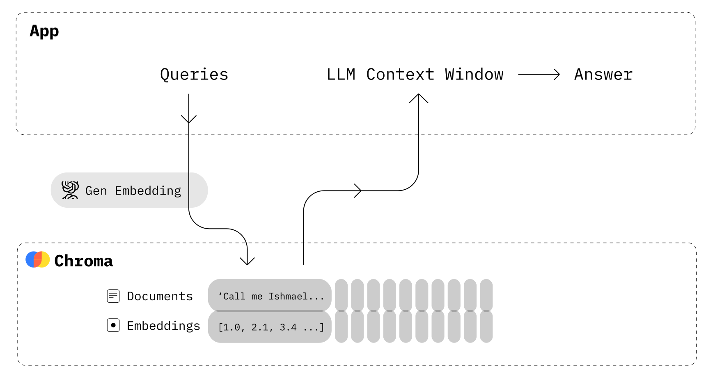

# **Chroma Vector Database**

**What it is:**
Chroma is a **vector database** designed to store, manage, and retrieve **embeddings** (vectors) produced by AI models, particularly **Large Language Models (LLMs)** and other machine learning algorithms. It's open-source and designed for **developers**, making it easy to integrate with modern applications. Chroma is especially useful for creating **semantic search systems**, recommendation engines, and AI applications where similarity search plays a key role.

#### **Why Chroma is Useful (Explained Simply)**

1. **Semantic Search**: Instead of matching exact words, Chroma allows you to search by meaning. For example, if you search for “How to stay healthy?” it might return articles about exercise, healthy eating, and mental well-being, even if those exact words weren’t used.

2. **AI-Powered**: Chroma is designed to work well with **machine learning models**, especially AI models like GPT (which generate embeddings). These embeddings capture the essence of what a text or piece of data means, so Chroma can store and retrieve this **meaningful** information.

3. **High Efficiency**: It can handle **large-scale** datasets (millions of vectors) and still retrieve the most relevant results quickly. This makes it perfect for businesses with a lot of data to search through.

4. **Real-time Updates**: Chroma can update its database quickly, meaning you can add new data (like new documents or product descriptions) and immediately start searching through it.

#### **How Chroma Works (In Layman’s Terms)**

Let’s say you have a **large collection of articles** or **documents**. You want to help people find relevant articles based on the ideas and topics they’re searching for, rather than the exact words they use. This is where Chroma comes in:

1. **Document Ingestion**: When you add a document to Chroma, it sends that document to an AI model (like GPT) to create an **embedding** (a vector representation of the document’s meaning).
  
2. **Embedding Storage**: Chroma stores these embeddings (vectors) in a database. Each vector represents the core meaning of a document or a part of it.

3. **Similarity Search**: When a user searches for something, Chroma creates an embedding (a vector) from the search query and compares it with the stored vectors to find the most **similar** ones. Instead of looking for word matches, it looks for **meaning matches**.

4. **Results**: The user is shown documents that are **most relevant in meaning** to their search, even if the words don’t match exactly.

#### **Real-Life Example of Chroma**

Imagine you have a platform with **thousands of research papers** on health and wellness. Users come to your platform looking for articles on different health topics. They might type in something like “benefits of exercising.” Here’s how Chroma helps:

- Chroma doesn’t just look for papers with the words “benefits” and “exercising.” Instead, it searches for papers that **talk about topics related to exercising**, such as fitness, mental health, longevity, etc.
- This way, even if a paper’s title is “The Effect of Physical Activity on Mental Well-being,” it might still come up in the search because the paper talks about the **same idea** as the user’s query.

This makes the search more **intelligent** and **useful** compared to a traditional keyword-based search.

#### **Why Chroma Stands Out**

- **Easy Integration**: Chroma is simple to integrate into modern applications, making it accessible to developers who want to add semantic search capabilities.
  
- **Performance**: It is optimized for fast searches even in large datasets, meaning it can handle millions of documents and still return results in seconds.

- **AI-Powered Search**: Since it works well with embeddings created by modern AI models, the search results are highly accurate and based on meaning rather than just keywords.

# **Chroma DB Workflow: Detailed Explanation**

The **workflow** of Chroma DB involves a series of steps to transform raw data (such as text) into vectors, store them, and later retrieve them based on similarity searches. Here’s a **step-by-step breakdown** of the Chroma DB workflow:

---

### **1. Ingesting Raw Data (Documents, Text, Images, etc.)**

The first step in the Chroma DB workflow is receiving raw data, which could be:

- **Text documents** (like articles, blogs, research papers)
- **Image files** (photos, artwork, etc.)
- **Audio files** (music, spoken words, etc.)

This data will be processed and converted into embeddings (vectors) that can be stored and searched.

For example, if you have a **document** about climate change, Chroma DB would ingest this document, and this text would be passed to an AI model to generate embeddings.

---

### **2. Generating Embeddings**

Once the data is ingested, the next step is generating embeddings. This process involves:

- **AI Model Integration**: Chroma DB connects with an AI model like GPT-3, BERT, or other transformer models that are specialized in creating embeddings.
  
- **Embedding Creation**: The AI model processes the raw data and converts it into an **embedding** (which is essentially a vector in high-dimensional space). These embeddings capture the **semantic meaning** of the data. For example:
  - A document about climate change is turned into a vector that represents the meaning of "climate change, environment, global warming," etc.

This embedding is just a **long list of numbers** (a vector) that encapsulates the **essence** of the document.

---

### **3. Storing Embeddings in Chroma DB**

After the embeddings are generated, Chroma DB stores them in its database:

- **Vector Storage**: Each embedding (vector) is stored in Chroma DB along with metadata about the original data (like the document’s title, ID, or other identifying information).
  
- **Efficient Indexing**: Chroma DB organizes these vectors using advanced **indexing techniques** to make it easier to search through them later. These techniques (such as **ANN – Approximate Nearest Neighbor search**) help Chroma quickly retrieve similar vectors during searches.

For example, the embedding for the climate change document is stored in the database, indexed by its meaning, and tied to the original document so that it can be retrieved later.

---

### **4. Querying the Database (Searching for Similarity)**

Once the embeddings are stored, users can **query** the database to find similar documents, images, or audio based on **meaning**:

- **User Query**: A user might search for something like “effects of global warming” or “how to stop climate change.”
  
- **Query Embedding**: Chroma DB sends this query to the AI model, which generates a new embedding for the query. This embedding represents the **meaning** of the user’s query, not just the keywords.

For instance, a query like “effects of global warming” would generate a vector that captures the meaning of environmental effects, temperature rise, and related topics.

---

### **5. Searching for Similar Embeddings**

With the query embedding ready, Chroma DB performs a **similarity search** to find relevant embeddings in its database:

- **Distance Calculation**: Chroma calculates the **distance** between the query embedding and the stored embeddings (using algorithms like cosine similarity, Euclidean distance, etc.).
  
- **Similarity Ranking**: Embeddings that are **closest** in meaning (i.e., with the smallest distance) to the query are ranked higher and selected as results.

For example, if you search for "effects of global warming," Chroma DB would look for documents in its database that have embeddings closest in meaning to this query.

---

### **6. Retrieving and Displaying Results**

Once the most similar embeddings are found:

- **Results Retrieval**: Chroma DB retrieves the original data associated with the similar embeddings. These could be documents, images, or audio files.

- **Displaying Results**: The user is presented with the most relevant documents based on the **semantic similarity** of the content.

For instance, after searching for "effects of global warming," Chroma DB would return documents that discuss climate change, rising temperatures, or environmental impact, even if those documents don’t have the exact words “global warming.”

---

### **7. Updating the Database**

Chroma DB allows for **real-time updates**, meaning you can add new documents or data and have them immediately indexed for future searches:

- **Adding New Data**: As new data is added (such as new articles or files), Chroma DB processes them, generates embeddings, and stores them in the database, making the system dynamic and always up-to-date.
  
- **Re-indexing**: Chroma DB automatically updates its indexing so that the new embeddings are ready for fast and efficient retrieval.

---

### **Chroma DB Workflow Example: Recommending Articles**

To summarize this process, let's take a simple example of recommending articles:

1. **Ingest**: You have a website with thousands of articles about technology, and you want to recommend similar articles to users based on what they are currently reading.
   
2. **Embedding Creation**: For each article, Chroma DB generates an embedding using an AI model. These embeddings represent the core meaning of each article.

3. **Store**: Chroma DB stores all these embeddings in the database and organizes them for efficient searching.

4. **Query**: A user reads an article about “Artificial Intelligence in Healthcare” and wants to find similar articles.

5. **Search**: The system generates an embedding for the user’s query (the current article they are reading) and searches through the database to find similar articles based on meaning.

6. **Results**: The user is shown articles about AI, healthcare, medical technology, and similar topics, even if those exact keywords weren’t used.

---

### **Why Chroma DB Workflow is Efficient**

1. **Handles Large Data Volumes**: Chroma can store **millions** of vectors and search through them quickly, making it ideal for applications like search engines, recommendation systems, and AI tools.
  
2. **Semantic Search**: It searches based on **meaning**, not just exact words, making it more powerful and relevant for modern applications.

3. **Real-time Updates**: You can constantly add new data, and it will be immediately available for searching, which is useful for dynamic environments like news websites or e-commerce.

4. **AI-powered Flexibility**: By using AI models to generate embeddings, Chroma can handle a wide range of data types—text, images, and audio—all in one system.

---

### **Conclusion**

Chroma DB transforms raw data into meaningful **embeddings** (vectors), stores them efficiently, and provides fast, **semantic search** capabilities. By leveraging AI models and powerful similarity search algorithms, Chroma makes it easy to build applications that can retrieve relevant information based on the **meaning** of the data, not just keywords.

This workflow is highly useful in areas like:

- **Recommendation systems**
- **Search engines**
- **Natural Language Processing (NLP) applications**
- **Image and document retrieval**

In short, Chroma DB's workflow allows organizations to efficiently handle massive datasets while offering smarter, more meaningful ways to search and recommend information to users.

