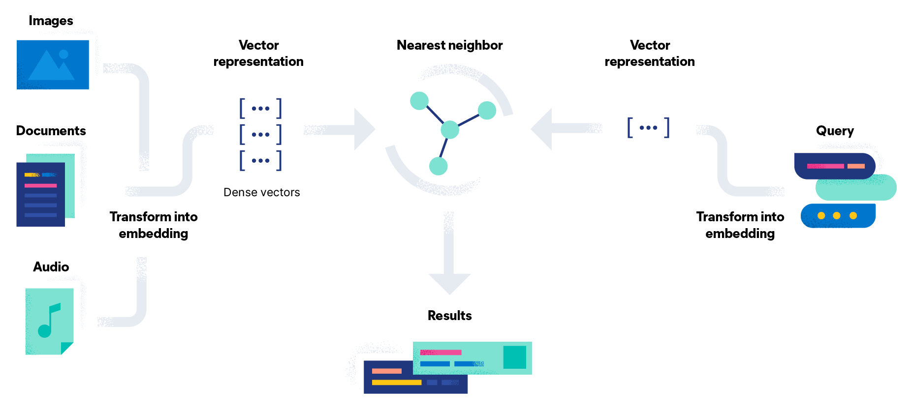

# Vector Databases
A **vector database** is a type of database that specializes in storing, searching, and retrieving data represented as **vectors**. Vectors are mathematical objects that are essentially lists of numbers, used to represent information in a way that computers can process efficiently. To break it down, let's explore the concept in a simple, understandable way.

### What is a vector?

Imagine you have a **profile** of a person, which includes their age, height, weight, and income. You can represent this information as a list of numbers (for example, `[28, 170, 75, 50000]`), where each number corresponds to one of these features. This list is a vector. In the same way, any kind of data—whether it’s text, images, or audio—can be transformed into vectors using mathematical techniques.

### Why are vectors useful?

Vectors allow computers to process and compare different types of data in a uniform way. For example, when you look for "similar" items (such as similar movies, products, or even similar faces), vectors make this possible by representing complex objects (like a movie's genre, style, and reviews) as numbers. Vectors enable algorithms to calculate how close or similar two objects are.

### How is a vector database different from a traditional database?

In a **traditional database**, data is often stored in a structured way, like in tables with rows and columns (similar to a spreadsheet). You can search this data using specific values. For example, you might ask a traditional database to find all people who are 28 years old or earn $50,000 a year.

A **vector database**, on the other hand, allows you to search for things based on **similarity** rather than specific values. Instead of asking "who is 28 years old?", you might ask "who is most similar to this person based on all of their attributes?" The database will look for other vectors (lists of numbers) that are close to the vector you’re searching for. This is especially useful in applications like:

- **Search engines**: Finding similar documents or web pages.
- **Recommendation systems**: Suggesting similar movies, songs, or products.
- **Image recognition**: Finding pictures that look alike.
- **Natural language processing (NLP)**: Comparing texts to find related meanings or similar sentences.

### How does a vector database work?

1. **Data Encoding (Vectorization)**: First, the raw data (like text, images, or audio) is converted into vectors. For example, if you want to store pictures of cats and dogs, you use special machine learning models to convert each picture into a list of numbers that represent its features (like shape, color, or texture).

2. **Storing Vectors**: These vectors are stored in the vector database. The database is optimized to handle millions or billions of vectors.

3. **Searching by Similarity**: When you want to find similar items, the vector database uses mathematical techniques to measure the distance between vectors (using something called **cosine similarity** or **Euclidean distance**, for example). The closer two vectors are, the more similar the items they represent are considered to be.

4. **Efficient Retrieval**: Vector databases are designed to quickly retrieve the most similar vectors, even if there are millions of them. Traditional databases would struggle to do this efficiently because they aren’t built for similarity-based searches.

### Real-world Examples of Vector Databases

1. **Search Engines**: Google or Bing can search not just for exact keywords but also for results related in meaning, thanks to vectors. If you search for “best laptops for students,” the search engine will also show results for similar queries like “affordable laptops for college” because these queries are represented by similar vectors.

2. **Recommendation Systems**: Netflix or Spotify recommends shows, movies, or songs that are similar to what you've watched or listened to before. They use vector databases to represent the characteristics of the content (genre, actors, or style) as vectors and then find similar ones to recommend.

3. **Chatbots**: When you interact with a chatbot that understands human language (like customer service bots), it uses vectors to understand the meaning of your sentences. For instance, "I need help with my account" and "Can you assist with my profile?" might be treated as similar because the chatbot's vector database can measure how close these sentences are in meaning.

### Why is the use of vector databases growing?

As we move deeper into the world of **artificial intelligence (AI)**, we need databases that can handle **unstructured data** like text, images, and videos. Traditional databases work well with structured data (like numbers and categories), but when it comes to finding similarities or patterns in more complex data types, vector databases shine.

For example:
- AI applications like image recognition or language models require comparing complex data to find similarities (like finding similar faces in a photo or identifying the topic of a document).
- Vectors allow you to search through massive amounts of data quickly and efficiently, which is essential as we deal with more data than ever before.

### In summary:
A **vector database** is specialized for handling and searching large amounts of data that has been transformed into vectors. It's especially useful in AI-driven tasks, such as finding similarities between objects (like images, text, or even people) and making recommendations. With the growing use of AI and machine learning, vector databases are becoming more popular because they are designed to manage and search unstructured data in a way that traditional databases cannot.

# How a Vector Database works?
To provide a **step-by-step analysis** of how a **vector store** works—from receiving a document to storing it as a vector—we’ll break down the entire process. This includes data preparation, transformation, and storage in a vector database (or vector store). Here's how the journey typically looks:

### 1. **Receiving the Document**
The process begins when a **document** (or any other form of data like text, image, or audio) is submitted to the system. A document could be an article, a product description, a user query, or any form of unstructured data.

#### Example: 
Imagine we are working with a text document, like a product description for an online store.

- **Input**: "This is a high-quality leather jacket, perfect for winter."

### 2. **Preprocessing the Document**
Before converting the document into a vector, it may need to undergo **preprocessing**. This step ensures that the data is clean and ready to be vectorized. Preprocessing can involve different steps depending on the type of data (text, images, etc.).

For a **text document**, preprocessing might include:
- **Tokenization**: Breaking the document into individual words or sentences.
- **Lowercasing**: Converting all text to lowercase to avoid treating "Jacket" and "jacket" as different words.
- **Removing Stop Words**: Filtering out common words like "the," "is," or "for" that don’t carry much meaning.
- **Stemming/Lemmatization**: Reducing words to their base form (e.g., "running" becomes "run").

#### Example after preprocessing:
- **Processed text**: "high-quality leather jacket perfect winter"

### 3. **Vectorization (Converting Document to a Vector)**
Once the document is preprocessed, the next step is to convert it into a **vector**. This process is called **vectorization**, and it involves transforming the document into a list of numbers that mathematically represent the features of the data.

For text documents, vectorization is often done using:
- **TF-IDF (Term Frequency-Inverse Document Frequency)**: A method that assigns a numerical value to each word in the document, based on how important that word is in the overall dataset.
- **Word Embeddings (e.g., Word2Vec, GloVe)**: These techniques represent words in a continuous vector space, capturing semantic relationships between words.
- **Transformer Models (e.g., BERT, GPT)**: More advanced techniques that can capture the context and meaning of words in relation to each other.

#### Example:
Let’s say we use a word embedding model like Word2Vec. It converts the processed text into a vector that might look like this:

- **Vector**: `[0.25, 0.83, 0.11, -0.56, 0.67, ...]` (This is a simplified representation; in reality, vectors can be hundreds of dimensions long.)

### 4. **Storing the Vector in the Vector Database**
Once the document is converted into a vector, this vector (along with some metadata about the document) is stored in the **vector database**.

The vector database specializes in handling high-dimensional vectors efficiently and supports similarity searches. When storing the vector, the database often retains:
- The **document's original content** or a reference to the original document.
- The **vector** that represents the document.
- **Metadata** like timestamps, categories, or other additional information.

#### Example:
- **Stored Entry**: 
    - Original Document: "This is a high-quality leather jacket, perfect for winter."
    - Vector: `[0.25, 0.83, 0.11, -0.56, 0.67, ...]`
    - Metadata: `{category: "clothing", timestamp: "2024-10-23"}`

### 5. **Indexing the Vector for Efficient Searching**
In addition to storing the vector, the vector database needs to **index** it. Indexing is what enables the database to perform fast similarity searches later on.

Popular indexing techniques for vector databases include:
- **Approximate Nearest Neighbor (ANN)** methods, such as **HNSW (Hierarchical Navigable Small World)** or **LSH (Locality-Sensitive Hashing)**. These methods make it possible to search for vectors that are "close" to a query vector very efficiently, even when dealing with millions or billions of vectors.

### 6. **Similarity Search and Querying**
Once the vector is stored and indexed, the vector store can now perform searches based on **similarity**.

For example, if you want to search for documents similar to another leather jacket description, you can:
- **Convert the query document** into a vector using the same vectorization process.
- **Search for similar vectors** in the vector store using a similarity metric, such as **cosine similarity** or **Euclidean distance**.

The database will return the most similar vectors and their associated documents.

#### Example Query:
- Query: "Find jackets similar to: 'Stylish winter coat, made of wool, very warm.'"
- This query will be vectorized, and the vector store will return vectors of documents that are closest in meaning to this description.

### 7. **Returning the Results**
Once the vector store identifies the most similar vectors, it will return the **corresponding documents** to the user. The results may include a list of relevant documents, sorted by how similar they are to the query.

#### Example Output:
- Similar results: 
    1. "High-quality leather jacket, perfect for winter" (cosine similarity score: 0.95)
    2. "Woolen winter coat, extremely cozy and warm" (cosine similarity score: 0.92)
    3. "Lightweight jacket, suitable for fall" (cosine similarity score: 0.85)

### Recap of the Step-by-Step Process:
1. **Document Reception**: Receive the document (e.g., a text description).
2. **Preprocessing**: Clean and prepare the document (tokenize, remove stop words, etc.).
3. **Vectorization**: Convert the document into a numerical vector using techniques like Word2Vec, BERT, or TF-IDF.
4. **Storing the Vector**: Store the vector along with metadata in the vector database.
5. **Indexing**: Create an index for efficient similarity searching.
6. **Similarity Search**: When querying, convert the query into a vector and find the closest vectors in the database.
7. **Return Results**: Retrieve and present the most similar documents.

This process makes it possible for vector stores to power **AI-driven applications** like recommendation systems, semantic search engines, and more by enabling the efficient storage and retrieval of data based on **similarity** rather than exact matches.

# What is the difference between EMBEDDINGS and VECTORS?
### What Are Embeddings?

**Embeddings** are a type of representation for data—usually in the form of **dense vectors**—that map complex, unstructured data like words, sentences, images, or user profiles into a **numerical space**. These embeddings capture **relationships and similarities** in the data so that similar items are represented by vectors that are close to each other in that space.

In simpler terms:
- **Embeddings** convert real-world data into a list of numbers, where the **meaning** or **context** of the data is embedded into these numbers.
- They are commonly used in **machine learning** to represent complex data in a way that makes it easier for algorithms to understand, compare, and find patterns.

#### Example:
If you have two words, "king" and "queen," an embedding model might represent them as:
- "king" → `[0.7, 0.5, 0.3]`
- "queen" → `[0.7, 0.4, 0.4]`

These vectors are similar because the words "king" and "queen" have related meanings.

### What Are Vectors?

**Vectors** are simply lists of numbers (sometimes called arrays) that represent points in a multi-dimensional space. They are a general mathematical concept, widely used in many fields beyond machine learning and data science, such as physics, economics, and graphics.

In the context of embeddings:
- Vectors are the **numerical representation** produced by embedding techniques.
- They serve as a format for representing data in machine learning models or vector databases.

Vectors can have any dimension (for example, a 3-dimensional vector `[0.7, 0.5, 0.3]` or a 300-dimensional vector depending on the model).

### Key Differences Between Embeddings and Vectors

1. **Purpose**:
   - **Embeddings** are designed specifically to capture relationships or patterns in data, like **semantic meaning** for words, **similarity** between images, or other forms of latent information.
   - **Vectors** are the format or structure used to represent data mathematically. They can be generated from any kind of process (not necessarily embeddings) and don't inherently capture relationships between data unless they are generated from an embedding process.

2. **Creation Process**:
   - **Embeddings** are generated using **machine learning models** that have been trained on large datasets to capture relationships. Popular techniques include:
     - **Word embeddings** like **Word2Vec**, **GloVe**, or **FastText** for text.
     - **Image embeddings** using **convolutional neural networks (CNNs)**.
     - **Sentence embeddings** using models like **BERT** or **GPT**.
   - **Vectors**, on the other hand, can be created from simple mathematical processes like assigning random numbers or basic feature extraction. They are more generic and do not necessarily carry any contextual or meaningful information unless they come from an embedding process.

3. **Context and Meaning**:
   - **Embeddings** are specifically built to preserve the **semantic meaning** or **similarity** between data points. For example, embeddings will place words with similar meanings (like "car" and "automobile") close to each other in the vector space.
   - **Vectors**, in a general sense, don’t inherently represent similarity or meaning unless they’ve been produced by some meaningful process (like embeddings). For example, a vector representing physical forces or geographical coordinates does not inherently capture "similarity" between data points in a human-understandable way.

### Example: Text Embeddings vs. Arbitrary Vectors
Imagine you have two sentences:
- **Sentence 1**: "The cat sat on the mat."
- **Sentence 2**: "A dog lay on the rug."

If you use a language model to generate embeddings for these sentences, their vectors might look like this:
- Sentence 1 → `[0.8, 0.2, 0.9, -0.1, 0.4, ...]`
- Sentence 2 → `[0.7, 0.3, 0.8, -0.2, 0.5, ...]`

These vectors will be **close to each other** in the embedding space because the sentences have similar meanings (both describe animals resting on surfaces).

Now, imagine you just randomly assign vectors to these sentences:
- Sentence 1 → `[2.3, 1.5, -0.7, 0.4]`
- Sentence 2 → `[-1.2, 3.4, 0.9, -2.7]`

These **arbitrary vectors** don't carry any meaning, and their values were assigned without regard to the content of the sentences. In this case, the vectors don't represent anything semantically useful.

### Use Cases for Embeddings

1. **Search Engines**: Search queries can be embedded into vectors, and then the vector representing the query can be compared to vectors representing web pages or documents. This allows the search engine to find documents that are **semantically similar** to the query, even if they don’t contain the exact keywords.

2. **Recommendation Systems**: Embeddings are used to recommend content by representing user preferences, behaviors, or content attributes as vectors. Similar vectors imply that the user would be interested in similar items.

3. **Natural Language Processing (NLP)**: Embeddings are essential in many NLP tasks like machine translation, text classification, or sentiment analysis, as they capture the **meaning** of words or sentences.

4. **Image and Video Recognition**: In computer vision, embeddings are used to represent images or video frames in a way that similar-looking objects are mapped to vectors that are close together in the embedding space.

### Summary:
- **Embeddings** are specialized **dense vectors** that represent complex data like text, images, or user preferences in a way that captures **relationships** and **similarities**.
- **Vectors** are general lists of numbers and can represent anything. In the case of embeddings, vectors are the output that carry the embedded meaning or similarity of the original data.

Embeddings are essentially a **type of vector** created using machine learning to capture meaningful patterns in the data, while not all vectors are embeddings.

### How Do Large Language Models (LLMs) Work?

**Large Language Models (LLMs)** like GPT-4 or BERT are advanced machine learning models that are trained to understand, generate, and manipulate human language. They are built on the **transformer architecture**, which allows them to handle complex patterns in text and learn contextual relationships between words, sentences, and even entire documents.

Here’s a step-by-step breakdown of how LLMs work and how they relate to **vector databases**:

### 1. **Training on Large Datasets**

LLMs are trained on massive amounts of textual data from the web, books, and other resources. The training involves learning the **patterns**, **syntax**, and **semantics** of language.

- During training, LLMs predict the next word in a sentence based on the previous words. For instance, if the model sees "The cat is on the", it will predict "mat" because it has learned that "cat" and "mat" often appear together in this context.
- Through billions of these predictions, the model starts learning how language works in a **general sense**, including grammar, meaning, and structure.

### 2. **The Transformer Architecture**

The core of LLMs is the **transformer architecture**, which uses mechanisms like **self-attention** to understand context. Self-attention helps the model focus on the most relevant parts of a sentence while processing it, rather than just relying on the immediate neighboring words.

- **Self-Attention**: If you have a sentence like "The dog chased the ball, and then it rolled down the hill," the word "it" refers to "the ball." The transformer model’s self-attention mechanism helps it focus on this relationship, recognizing that "it" corresponds to "ball," even though they are separated by multiple words.

### 3. **Tokenization and Embeddings**

When a piece of text is fed into an LLM, the first step is **tokenization**, where the text is split into smaller units like words or subwords (tokens). These tokens are then converted into **embeddings**—numerical representations of words that capture their meanings and relationships.

- **Embeddings**: The LLM creates **dense vectors** that represent the tokens. These vectors are placed in a **high-dimensional space**, where words with similar meanings have similar vectors. For instance, the embeddings for "cat" and "dog" will be close together, while "cat" and "car" will be farther apart.

### 4. **Generating Outputs**

Once the model has the embeddings, it processes them through several layers of transformers, applying attention and other transformations to understand the overall context. The model then generates outputs based on the input text.

- For instance, if you ask an LLM, "What is the capital of France?", the model will use its learned knowledge to generate "Paris" as the answer.

### 5. **Relationship with Vector Databases**

Vector databases come into play when you want to **store** and **search** the embeddings generated by LLMs. Here’s how:

1. **Embeddings from LLMs**:
   - When LLMs process text, they generate embeddings (vectors) for that text. These embeddings capture the **semantic meaning** of the input text and are crucial for tasks like **semantic search** or **document retrieval**.
   
   Example: 
   - Text: "What is the best way to train a dog?"
   - Embedding: `[0.23, -0.67, 1.24, 0.89, ...]` (a high-dimensional vector).

2. **Vector Database for Storing Embeddings**:
   - A **vector database** stores these embeddings efficiently. In contrast to traditional databases, which store data in structured formats (like tables), a vector database is optimized for **high-dimensional vectors**.
   - For instance, if you have a large collection of documents, you can convert each document into an embedding using an LLM and store these embeddings in a vector database.

3. **Vector Search (Similarity Search)**:
   - When you perform a query, the input query is also converted into an embedding by the LLM.
   - The vector database then performs a **similarity search**—finding the vectors (and associated documents) in the database that are most similar to the query vector.

   Example:
   - Query: "How do I train my puppy?"
   - Query Embedding: `[0.22, -0.65, 1.25, 0.88, ...]`
   - The vector database searches for document vectors similar to the query embedding and returns the most relevant documents, even if the exact words "train my puppy" don’t appear in those documents.

4. **Efficient Retrieval**:
   - Vector databases often use **Approximate Nearest Neighbor (ANN)** algorithms to efficiently find similar vectors in massive datasets. This allows the system to quickly retrieve semantically similar results from a large corpus, even when there are millions or billions of stored vectors.

### Use Cases of LLMs with Vector Databases

1. **Semantic Search**:
   - Instead of keyword matching, which is limited to exact word matches, you can use LLM-generated embeddings to search based on **meaning**.
   - A query like "What's the weather like today?" can retrieve documents or information about weather conditions even if they don’t use the exact phrase "weather like today."

2. **Recommendation Systems**:
   - You can use LLMs to generate embeddings for user profiles and content (articles, videos, products) and store them in a vector database. The system can then recommend content to users based on **vector similarity**—finding items that match the user's interests or past behavior.

3. **Document Retrieval**:
   - LLMs can generate embeddings for legal documents, medical papers, or research articles, and vector databases can be used to perform **semantic retrieval**. This allows users to find relevant documents based on meaning, not just specific keywords.

4. **Question-Answering Systems**:
   - LLMs can be combined with vector databases to build powerful **Q&A systems**. When a user asks a question, the LLM generates a vector for the question, and the vector database finds the most relevant documents or passages that answer it.

### Summary of How LLMs Work with Vector Databases:

1. **LLMs generate embeddings** (vectors) for text, capturing semantic meaning and context.
2. **Vector databases store these embeddings**, allowing large volumes of high-dimensional vectors to be indexed efficiently.
3. When a query is processed, it is converted into an embedding by the LLM, and the vector database performs a **similarity search** to find the most relevant vectors (and associated documents).
4. This process enables advanced applications like **semantic search**, **recommendation systems**, and **intelligent document retrieval**, where results are based on meaning rather than just keyword matching.

In essence, **LLMs** create the embeddings (vectors), and **vector databases** store and search those embeddings efficiently to enable intelligent retrieval of information based on semantic similarity.

# Most Used Vector Databases and Why They Are Useful?

**Vector databases** are specialized databases designed to handle and search through **embeddings** (which are high-dimensional vectors) generated by AI models like **Large Language Models (LLMs)**. These embeddings capture the meaning or patterns in data (such as text, images, or audio), making it possible to search and retrieve information based on **similarity of meaning** rather than exact matches.

Let’s explore some popular vector databases and why they are useful in simple terms.

---

### 1. **Pinecone**

**What it is:**
- Pinecone is a vector database service that makes it easy to store and search through large amounts of embeddings (vectors). It is a fully managed service, meaning you don’t need to worry about setting up or maintaining infrastructure.

**Why it’s useful:**
- **Fast and Scalable:** Pinecone allows you to handle millions (or even billions) of vectors efficiently, meaning you can quickly search for similar items.
- **Simple to Use:** You don’t need a lot of technical knowledge to use it. Pinecone handles the hard parts like indexing (organizing the data) and retrieving similar vectors.

**Real-life example:**
- Imagine you’re running an online store with a huge collection of products. Pinecone can help you recommend similar items to customers based on what they’re currently viewing, even if the words used to describe the items are different. It’s like matching the **meaning** of what they’re interested in, rather than just the words.

---

### 2. **FAISS (Facebook AI Similarity Search)**

**What it is:**
- FAISS, developed by Facebook AI, is an open-source library that allows you to efficiently search through a large collection of vectors. It’s not a full database like Pinecone but a tool to search for similar vectors quickly.

**Why it’s useful:**
- **High Performance:** FAISS is great at searching through massive datasets very quickly.
- **Customizable:** You can adjust FAISS to fit your needs, such as making the searches more accurate or faster depending on what you want.

**Real-life example:**
- Say you’re managing a music recommendation app. FAISS can help you find songs that have a similar **vibe or mood** based on the music patterns (even if the songs have different genres or instruments). It’s like finding songs that feel the same without relying on exact names or keywords.

---

### 3. **Weaviate**

**What it is:**
- Weaviate is another open-source vector database that is specifically designed to search for embeddings. It also has built-in features for **semantic search** (finding information based on meaning) and is highly customizable.

**Why it’s useful:**
- **Real-Time Semantic Search:** Weaviate can handle real-time searches where you look for data based on what it means, not just the words.
- **Customizable with AI models:** You can integrate Weaviate with different AI models, making it flexible for various use cases (like searching through text, images, or even graphs).

**Real-life example:**
- If you run a company with a massive archive of customer emails, Weaviate can help you find emails that talk about similar problems, even if the exact words aren’t the same. It’s like searching through thousands of emails for similar topics based on their overall **meaning**.

---

### 4. **Milvus**

**What it is:**
- Milvus is another open-source vector database designed for storing and searching through large amounts of embeddings. It is built to handle massive datasets and works well with AI and machine learning applications.

**Why it’s useful:**
- **Handles Large Data Volumes:** Milvus can store and search through very large datasets, making it ideal for applications where you have millions or billions of vectors.
- **Flexible Data Support:** Milvus supports different types of data (like images, videos, and text) and allows you to perform similarity searches across all of them.

**Real-life example:**
- Imagine you have a huge collection of images and want to find all the images that are **visually similar** to a particular picture (like finding all images that contain dogs, even if they’re not labeled as such). Milvus can help you do this by searching through the **visual patterns** in the images, not just the image file names.

---

### 5. **Qdrant**

**What it is:**
- Qdrant is an open-source vector database that focuses on **neural search** and **recommendation systems**. It’s designed for fast and accurate searches and can be easily integrated into applications.

**Why it’s useful:**
- **Accurate Neural Search:** Qdrant specializes in finding the most relevant vectors (which represent things like text, images, or audio) based on their similarity.
- **Real-time Updates:** You can add new data to the system and get immediate search results, making it great for real-time applications.

**Real-life example:**
- Suppose you have a video streaming platform. Qdrant can help you recommend new movies or shows to users based on their preferences and viewing history, even if the new content doesn’t exactly match the old ones. It’s like finding shows that **feel similar** based on past choices.

---

### **Chroma Vector Database**

**What it is:**
Chroma is a **vector database** designed to store, manage, and retrieve **embeddings** (vectors) produced by AI models, particularly **Large Language Models (LLMs)** and other machine learning algorithms. It's open-source and designed for **developers**, making it easy to integrate with modern applications. Chroma is especially useful for creating **semantic search systems**, recommendation engines, and AI applications where similarity search plays a key role.

#### **Why Chroma is Useful (Explained Simply)**

1. **Semantic Search**: Instead of matching exact words, Chroma allows you to search by meaning. For example, if you search for “How to stay healthy?” it might return articles about exercise, healthy eating, and mental well-being, even if those exact words weren’t used.

2. **AI-Powered**: Chroma is designed to work well with **machine learning models**, especially AI models like GPT (which generate embeddings). These embeddings capture the essence of what a text or piece of data means, so Chroma can store and retrieve this **meaningful** information.

3. **High Efficiency**: It can handle **large-scale** datasets (millions of vectors) and still retrieve the most relevant results quickly. This makes it perfect for businesses with a lot of data to search through.

4. **Real-time Updates**: Chroma can update its database quickly, meaning you can add new data (like new documents or product descriptions) and immediately start searching through it.

#### **How Chroma Works (In Layman’s Terms)**

Let’s say you have a **large collection of articles** or **documents**. You want to help people find relevant articles based on the ideas and topics they’re searching for, rather than the exact words they use. This is where Chroma comes in:

1. **Document Ingestion**: When you add a document to Chroma, it sends that document to an AI model (like GPT) to create an **embedding** (a vector representation of the document’s meaning).
  
2. **Embedding Storage**: Chroma stores these embeddings (vectors) in a database. Each vector represents the core meaning of a document or a part of it.

3. **Similarity Search**: When a user searches for something, Chroma creates an embedding (a vector) from the search query and compares it with the stored vectors to find the most **similar** ones. Instead of looking for word matches, it looks for **meaning matches**.

4. **Results**: The user is shown documents that are **most relevant in meaning** to their search, even if the words don’t match exactly.

#### **Real-Life Example of Chroma**

Imagine you have a platform with **thousands of research papers** on health and wellness. Users come to your platform looking for articles on different health topics. They might type in something like “benefits of exercising.” Here’s how Chroma helps:

- Chroma doesn’t just look for papers with the words “benefits” and “exercising.” Instead, it searches for papers that **talk about topics related to exercising**, such as fitness, mental health, longevity, etc.
- This way, even if a paper’s title is “The Effect of Physical Activity on Mental Well-being,” it might still come up in the search because the paper talks about the **same idea** as the user’s query.

This makes the search more **intelligent** and **useful** compared to a traditional keyword-based search.

#### **Why Chroma Stands Out**

- **Easy Integration**: Chroma is simple to integrate into modern applications, making it accessible to developers who want to add semantic search capabilities.
  
- **Performance**: It is optimized for fast searches even in large datasets, meaning it can handle millions of documents and still return results in seconds.

- **AI-Powered Search**: Since it works well with embeddings created by modern AI models, the search results are highly accurate and based on meaning rather than just keywords.

### Why Are Vector Databases Useful?

In simple terms, vector databases help you store and find things based on **meaning** rather than just keywords or exact matches. They are powerful because they allow:

- **Semantic Search:** You can search for data based on the **meaning** or **concepts** behind it, not just the words or labels used.
- **Recommendation Systems:** By comparing vectors, you can suggest similar content (like songs, videos, or products) to users based on their preferences.
- **Image and Text Search:** You can find similar images or text even when the exact words or tags aren’t present.
- **Scalability:** These databases handle **huge** datasets, making them suitable for companies with millions of records (like e-commerce stores, streaming platforms, or social networks).

# Good Source to read further about Vector Databases

- <a href="https://thedataquarry.com/posts/vector-db-1/">Vector databases (1): What makes each one different?</a>
- <a href="https://thedataquarry.com/posts/vector-db-2/">Vector databases (2): Understanding their internals</a>
- <a href="https://thedataquarry.com/posts/vector-db-3/">Vector databases (3): Not all indexes are created equal</a>
- <a href="https://thedataquarry.com/posts/vector-db-4/">Vector databases (4): Analyzing the trade-offs</a>

